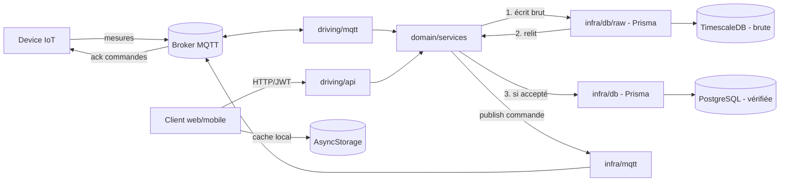

# Architecture

Ce document décrit l'architecture technique du projet Campify.

## Vue d'ensemble

Campify collecte des mesures IoT (température, humidité, etc.) publiées
par des devices via MQTT, les stocke et les expose via une API REST, et
permet d'envoyer des commandes aux devices (également via MQTT). Le
backend est le point de rencontre entre ces deux mondes : MQTT en entrée
(mesures) et sortie (commandes), API HTTP pour la consultation et le
pilotage.

## Composants

- **backend/** — API en Fastify (TypeScript), architecture hexagonale
  simplifiée : domaine métier au centre, adapters MQTT et HTTP en
  périphérie. Voir le détail ci-dessous et `backend/README.md`.
- **mobile/** — application mobile, React Native via Expo (TypeScript).
  Cache "dernière valeur connue" en local (AsyncStorage), voir
  [Cache mobile](#cache-mobile) ci-dessous.
- **infra/** — infrastructure et déploiement (à définir).

## Architecture backend

```
backend/src/
├── domain/            # cœur métier, aucune dépendance vers l'extérieur
│   ├── entities/         # Room, Device, Measurement, Command, User
│   ├── ports/            # interfaces vers l'infra
│   └── services/         # logique métier pure : fraîcheur, dédup/retard, alertes, commandes
│
├── infra/              # adapters, implémentent les ports
│   ├── db/                # repositories Prisma/Postgres (base vérifiée)
│   │   └── raw/              # repository Prisma/TimescaleDB (base brute)
│   └── mqtt/              # publisher MQTT (émission de commandes)
│
├── driving/             # ce qui déclenche le domaine
│   ├── mqtt/              # client mqtt.js, schémas Zod, handlers
│   └── api/               # routes Fastify, auth JWT, RBAC
│
├── composition.ts       # câblage : instancie adapters -> injecte dans les services
└── shared/              # logger (pino), config, erreurs typées, conventions MQTT
```

Règle centrale : `driving/mqtt` et `driving/api` appellent le même
domaine, jamais l'inverse, jamais l'un l'autre directement — ça évite de
dupliquer les règles de fraîcheur/dédup/alerte entre l'entrée MQTT et la
sortie API. Détail et justification dans
[docs/decisions/0001-architecture-hexagonale.md](decisions/0001-architecture-hexagonale.md).

## Schéma



## Persistance des mesures : base brute et base vérifiée

Toute mesure entrante (MQTT ou API) passe par
`MeasurementIngestionService.ingest()`, qui écrit dans **deux bases** :

1. **Base brute** (TimescaleDB, port `RawMeasurementRepository`) — reçoit
   systématiquement toute mesure entrante, sans filtre. C'est cette ligne,
   relue juste après écriture, qui alimente la suite du traitement (pas la
   donnée entrante en mémoire).
2. **Base vérifiée** (PostgreSQL, port `MeasurementRepository`) — ne reçoit
   que ce qui a passé la règle de déduplication/retard
   (`domain/services/dedup.ts`) ; c'est elle qui alimente l'API (dernière
   valeur, historique, présence).

Règle de déduplication/retard (`decideMeasurement`), appliquée à la
dernière mesure connue pour un device+type :

- même `messageId` MQTT que la dernière connue → **doublon**, rejeté quel
  que soit le timestamp (retransmission QoS ≥ 1) ;
- à défaut de `messageId`, même timestamp → **doublon** ; timestamp
  antérieur → **retard**, rejeté (ne remplace jamais l'état courant) ;
- timestamp postérieur → accepté, devient le nouvel état courant.

Détail et justification : [ADR 0005](decisions/0005-dedup-ordre-et-separation-base-brute-verifiee.md).

## Fraîcheur et présence

Deux notions distinctes, toutes deux dérivées des mesures reçues (jamais
d'un champ mutable maintenu à part) via `domain/services/freshness.ts`
(`isFresh(lastSeenAt, now, thresholdMs)`) :

- **Présence d'un device** (`GET /devices/:id` → `present`) — dérivée de
  `MAX(receivedAt)` sur toutes les mesures du device, tous types confondus.
- **Fraîcheur d'une mesure** (`GET /rooms/:id/measurements/latest` →
  `fresh` par mesure) — dérivée du timestamp propre à cette mesure. Peut
  diverger de la présence sur un device multi-métriques dont les capteurs
  n'envoient pas au même rythme.

L'historique exposé par `GET /devices/:id/measurements` est borné
(`domain/services/history.ts`) : fenêtre par défaut 24h, plage max 7
jours, 500 points max, pour qu'un client ne puisse jamais déclencher une
requête de stockage illimitée.

## Identité des devices et sécurité MQTT

Un `deviceId` (ex. `sensor-001`) est résolu **depuis le topic MQTT**
(`{prefix}/v1/devices/{deviceId}/telemetry`), jamais depuis le payload : les
champs `device_id`/`room_id` du payload sont redondants avec le topic et
ne sont pas exploités (voir [ADR 0004](decisions/0004-contrat-mqtt-placeholder.md)).
Ce choix n'a de sens que si le topic lui-même fait foi — c'est-à-dire que
seul le vrai device peut publier sur son propre topic. Le broker local
(`backend/docker-compose.yml`) l'impose désormais : connexion authentifiée
obligatoire (`mosquitto.conf`) et ACL par device (`mosquitto.acl`)
restreignant chaque identité à sa propre télémétrie/ses propres commandes.
Le broker de démonstration du kit (VPS partagé) reste hors de notre
contrôle et constitue un risque résiduel documenté. Détail et alternatives
écartées (mTLS, signature applicative) : [ADR 0008](decisions/0008-identite-devices-authentification-mqtt.md).

Toute mesure entrante passe ensuite par la validation de structure (Zod,
`driving/mqtt/schemas.ts`) puis par une borne de plausibilité physique par
type de métrique (`domain/services/plausibility.ts`, ex. température entre
-40 et 85°C) avant d'atteindre la base vérifiée — une valeur hors bornes ou
non finie (NaN/Infinity) est rejetée (`implausible_value`) mais reste
tracée en base brute, au même titre qu'un doublon ou un retard.

## Connexion MQTT : QoS et visibilité sur les coupures

`mqtt.js` reconnecte automatiquement en cas de coupure du broker
(`reconnectPeriod` par défaut), mais sans le signaler nulle part, "coupure
puis reprise" n'est qu'une hypothèse invérifiable. `driving/mqtt/client.ts`
journalise chaque transition (`eventType: 'mqtt_connection'`, `status`
parmi `connected`/`reconnecting`/`closed`/`offline`/`error`), pour pouvoir
filtrer ces événements dans les logs centralisés (scénario J3 "broker
indisponible").

QoS de souscription configurable (`MQTT_QOS`, 1 par défaut) : QoS 1 (au
moins une fois) correspond à ce que `domain/services/dedup.ts` a été conçu
pour absorber (retransmission avec même `messageId` — voir
[ADR 0005](decisions/0005-dedup-ordre-et-separation-base-brute-verifiee.md)).
Basculer à 0 pour le scénario J3 de comparaison QoS 0 vs QoS 1 sur
coupure/reprise du broker : QoS 0 n'est pas rejoué par le broker après une
reconnexion (messages perdus pendant la coupure), QoS 1 l'est (au prix de
doublons possibles, absorbés par la dédup).

## Cache mobile

L'app mobile garde en local (AsyncStorage, `mobile/src/storage/cache.ts`)
la dernière réponse connue par clé (ex. `room:{id}:measurements`), avec sa
date d'écriture. `RoomDetailScreen` affiche toujours cette date à côté des
mesures, qu'elles viennent d'un fetch réussi ou du cache. Un fetch en échec
ne remplace jamais ce qui est déjà affiché (donnée fraîche ou en cache) —
l'écran d'erreur n'apparaît que si rien n'a encore pu être affiché.

Trois déclencheurs de re-fetch automatique : montage de l'écran, retour au
premier plan (`useAppForeground`, sur `AppState`), retour réseau
(`useNetworkStatus`, sur `NetInfo`). La connectivité du téléphone
(`isConnected`, bannière "Téléphone hors ligne") est distincte de la
fraîcheur d'une mesure (`fresh`, badge "Capteur silencieux") : un capteur
qui se tait n'implique pas que le téléphone soit déconnecté, et
inversement. Détail et justification :
[ADR 0006](decisions/0006-cache-mobile-et-affichage-de-la-fraicheur.md).

## Choix techniques

| Domaine | Choix | Notes |
|---|---|---|
| Frontend mobile | React Native + Expo (TypeScript) | Scaffold `blank-typescript`, voir `mobile/` |
| Backend | Fastify (TypeScript) | Architecture hexagonale, voir `backend/` |
| Base de données vérifiée | PostgreSQL | Relationnel, entités et relations stables — voir [ADR 0002](decisions/0002-postgresql-et-prisma.md) |
| Base de données brute | TimescaleDB | Trace fidèle de toute mesure reçue avant dédup/retard, schéma Prisma séparé — voir [ADR 0005](decisions/0005-dedup-ordre-et-separation-base-brute-verifiee.md) |
| ORM | Prisma | Migrations + typage généré + mapping domaine/persistance explicite, deux schémas (`prisma/schema.prisma`, `prisma/raw/schema.prisma`) |
| Messagerie IoT | MQTT (mqtt.js) + Zod | Validation de schéma par topic avant tout passage au domaine — contrat provisoire, voir [ADR 0004](decisions/0004-contrat-mqtt-placeholder.md) |
| Dédup / ordre des mesures | `domain/services/dedup.ts` | `messageId` MQTT en priorité, sinon timestamp — voir [ADR 0005](decisions/0005-dedup-ordre-et-separation-base-brute-verifiee.md) |
| Cache mobile | AsyncStorage | Dernière réponse connue par clé + date, best-effort — voir [ADR 0006](decisions/0006-cache-mobile-et-affichage-de-la-fraicheur.md) |
| Auth & droits | JWT (`@fastify/jwt`) + RBAC | Distingue droits de consultation et droits de commande |
| Auth MQTT | mosquitto password_file + ACL par device (broker local) | Un device ne peut publier que sur sa propre télémétrie — voir [ADR 0008](decisions/0008-identite-devices-authentification-mqtt.md) |
| Plausibilité des mesures | `domain/services/plausibility.ts` | Bornes physiques par type de métrique, rejet avant la base vérifiée (trace conservée en base brute) |
| Logs | Pino | Logs structurés pour le diagnostic |
| Tests | `node:test` + fakes en mémoire (backend), Jest + `jest-expo` (mobile) | Unitaires sur `domain/services`, intégration par adapter (Prisma, handler MQTT), coupure/retour réseau et reprise d'app côté mobile |
| Infra | _à définir_ | |

Patterns explicitement écartés (CQRS, event sourcing, DDD strict,
microservices) et leur justification :
[ADR 0003](decisions/0003-exclusions-cqrs-event-sourcing-ddd-microservices.md).
