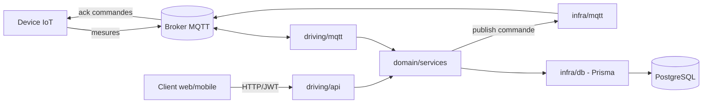

# Architecture

Ce document décrit l'architecture technique du projet Campify.

## Vue d'ensemble

Campify collecte des mesures IoT (température, humidité, etc.) publiées
par des devices via MQTT, les stocke et les expose via une API REST, et
permet d'envoyer des commandes aux devices (également via MQTT). Le
backend est le point de rencontre entre ces deux mondes : MQTT en entrée
(mesures) et sortie (commandes), API HTTP pour la consultation et le
pilotage.

## Composants

- **backend/** — API en Fastify (TypeScript), architecture hexagonale
  simplifiée : domaine métier au centre, adapters MQTT et HTTP en
  périphérie. Voir le détail ci-dessous et `backend/README.md`.
- **mobile/** — application mobile, React Native via Expo (TypeScript).
- **infra/** — infrastructure et déploiement (à définir).

## Architecture backend

```
backend/src/
├── domain/            # cœur métier, aucune dépendance vers l'extérieur
│   ├── entities/         # Room, Device, Measurement, Command, User
│   ├── ports/            # interfaces vers l'infra
│   └── services/         # logique métier pure : fraîcheur, dédup/retard, alertes, commandes
│
├── infra/              # adapters, implémentent les ports
│   ├── db/                # repositories Prisma/Postgres
│   └── mqtt/              # publisher MQTT (émission de commandes)
│
├── driving/             # ce qui déclenche le domaine
│   ├── mqtt/              # client mqtt.js, schémas Zod, handlers
│   └── api/               # routes Fastify, auth JWT, RBAC
│
├── composition.ts       # câblage : instancie adapters -> injecte dans les services
└── shared/              # logger (pino), config, erreurs typées, conventions MQTT
```

Règle centrale : `driving/mqtt` et `driving/api` appellent le même
domaine, jamais l'inverse, jamais l'un l'autre directement — ça évite de
dupliquer les règles de fraîcheur/dédup/alerte entre l'entrée MQTT et la
sortie API. Détail et justification dans
[docs/decisions/0001-architecture-hexagonale.md](decisions/0001-architecture-hexagonale.md).

## Schéma



## Choix techniques

| Domaine | Choix | Notes |
|---|---|---|
| Frontend mobile | React Native + Expo (TypeScript) | Scaffold `blank-typescript`, voir `mobile/` |
| Backend | Fastify (TypeScript) | Architecture hexagonale, voir `backend/` |
| Base de données | PostgreSQL | Relationnel, entités et relations stables — voir [ADR 0002](decisions/0002-postgresql-et-prisma.md) |
| ORM | Prisma | Migrations + typage généré + mapping domaine/persistance explicite |
| Messagerie IoT | MQTT (mqtt.js) + Zod | Validation de schéma par topic avant tout passage au domaine — contrat provisoire, voir [ADR 0004](decisions/0004-contrat-mqtt-placeholder.md) |
| Auth & droits | JWT (`@fastify/jwt`) + RBAC | Distingue droits de consultation et droits de commande |
| Logs | Pino | Logs structurés pour le diagnostic |
| Tests | `node:test` + fakes en mémoire | Unitaires sur `domain/services`, intégration par adapter (Prisma, handler MQTT) |
| Infra | _à définir_ | |

Patterns explicitement écartés (CQRS, event sourcing, DDD strict,
microservices) et leur justification :
[ADR 0003](decisions/0003-exclusions-cqrs-event-sourcing-ddd-microservices.md).
