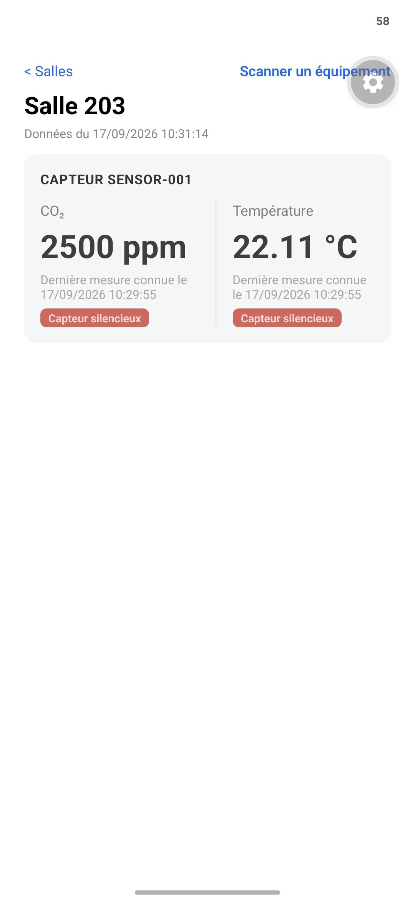
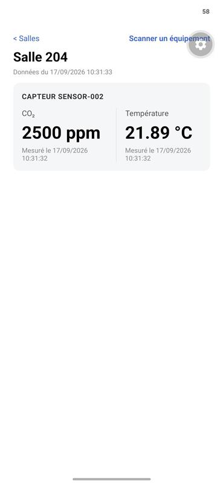

# Preuve — capteurs simulés en parallèle, ids stables, sans erreur

Contexte : préparation du scénario "Isolation des devices" (J3.md).
Vérifie que les 3 capteurs fournis par le kit tournent en parallèle, chacun
avec un identifiant stable et unique, sans erreur — avant toute
expérimentation (payload invalide, usurpation, etc.).

Environnement : simulateur du kit (`/root/MdsIoTMobile`, VPS), commandes
exécutées via `docker compose`, aucune modification apportée.

## Uptime et santé des conteneurs

```
$ docker compose ps
NAME                       IMAGE                       STATUS                  PORTS
mdsiotmobile-mosquitto-1   eclipse-mosquitto:2.0.22    Up 45 hours (healthy)   0.0.0.0:8080->1883/tcp
mdsiotmobile-simulator-1   sha256:080e02fcf22e...      Up 47 hours
```

## Absence d'erreur sur tout l'historique du simulateur

```
$ docker compose logs simulator | grep -iE "error|warn|traceback|exception"
(aucune ligne)
```

47h de fonctionnement continu, zéro ligne `ERROR`/`WARN`/`Traceback`/`Exception`
dans les logs du conteneur `simulator`.

## Connexions initiales des 3 devices — ids stables et distincts

Extrait de `docker compose logs --tail 30 simulator` :

```
simulator-1  | 2026-09-15 11:15:14,733 INFO sensor-002 connecté
simulator-1  | 2026-09-15 11:15:14,733 INFO sensor-003 connecté
simulator-1  | 2026-09-15 11:15:14,733 INFO sensor-001 connecté
```

Les mêmes trois identifiants (`sensor-001`, `sensor-002`, `sensor-003`)
apparaissent à chaque reconnexion observée dans l'historique — stables dans
le temps, jamais régénérés.

## Publication en parallèle, sans mélange — 15 messages capturés

Capture complète : [isolation-devices-paralleles.telemetry.log](isolation-devices-paralleles.telemetry.log)
(`docker compose run --rm tools watch --topic "campus/v1/devices/+/telemetry" --count 15`).

Constats sur les 15 messages :

- Les trois `device_id` (`sensor-001`, `sensor-002`, `sensor-003`) alternent
  librement sans ordre fixe — bien 3 flux indépendants, pas un seul device
  qui republie sous plusieurs identités.
- Chaque device a un préfixe de `message_id` stable et distinct sur toute la
  capture (`sensor-001` → `80da77ef1c964ffc971f34494346d93e-*`, `sensor-002`
  → `e7234fccb7264a7fbe6297687dbc4243-*`, `sensor-003` →
  `a33b063efa3c485682ff87c0fefbea2b-*`), avec un compteur qui s'incrémente
  séparément par device (ce préfixe est le `boot_id` généré une fois par
  démarrage de device — `simulator/model.py`, `Device.__init__`).
- Chaque `device_id` reste associé à son propre `room_id` sur tous les
  messages (`sensor-001`→`salle-203`, `sensor-002`→`salle-204`,
  `sensor-003`→`salle-205`) — aucune valeur d'un device qui apparaît sous
  l'identité d'un autre.

## Conclusion (partie simulateur)

Les trois capteurs simulés fonctionnent en parallèle avec un identifiant
stable et unique chacun, sans erreur constatée. Base saine pour dérouler le
scénario "Isolation des devices" à proprement parler (vérifier que le
**backend**, à son tour, garde ces trois flux séparés en base/API).

## Partie backend — les 3 flux restent-ils séparés une fois ingérés ?

Backend local (`docker-compose`, `MQTT_URL` pointant vers le broker du VPS
ci-dessus, mêmes 3 devices), interrogé via `GET /rooms/:id/measurements/latest`
pendant que les 3 capteurs publiaient en continu :

```
room Salle 203 → deviceId=sensor-001, messageId=80da77ef1c964ffc971f34494346d93e-84268, temp=22.12°C
room Salle 204 → deviceId=sensor-002, messageId=e7234fccb7264a7fbe6297687dbc4243-84434, temp=22.39°C
room Salle 205 → deviceId=sensor-003, messageId=a33b063efa3c485682ff87c0fefbea2b-84434, temp=22.3°C
```

**Données : isolation correcte.** Chaque salle ne renvoie que les mesures de
son propre device, avec le bon préfixe de `messageId` (= le `boot_id` du bon
device, vu dans la capture simulateur ci-dessus). Aucune mesure d'un device
qui apparaît sous une autre salle/device.

**Logs : gap constaté.** `docker logs backend-backend-1` sur tout
l'historique du conteneur ne contient **aucune** ligne mentionnant un
`sensor-00X` ni le mot `mqtt` — zéro trace de l'ingestion normale. En lisant
`backend/src/driving/mqtt/handlers.ts`, c'est cohérent avec le code : seuls
les chemins d'échec logguent (`logger.warn('failed to ingest measurement',
{ deviceId, ... })`, `logger.info('measurement rejected', { deviceId, ... })`)
— **aucun log n'existe pour une ingestion réussie**. Le scénario exige
pourtant : « les logs permettent de suivre séparément chaque deviceId » —
ce n'est vrai aujourd'hui que dans le cas d'erreur, pas dans le
fonctionnement normal.

### Décision

Pas de log permanent sur chaque mesure ingérée (rejeté après une première
tentative : trop de volume pour un usage continu — 3 devices × 2 métriques
× toutes les 2s). À la place, un test ciblé qui isole un seul device dans
le flux, sans changement de code, en s'appuyant sur les outils du kit.

### Vérification — test ciblé sur un seul device

Injection : `sensor-002` et `sensor-003` mis en pause via l'outil de
diagnostic du kit (connexion MQTT maintenue, mesures arrêtées) :

```
$ docker compose run --rm tools incident sensor-002 pause
{"device_id": "sensor-002", "action": "pause", "status": "ok", ...}
$ docker compose run --rm tools incident sensor-003 pause
{"device_id": "sensor-003", "action": "pause", "status": "ok", ...}
```

Observation : 8 secondes de logs du backend local (`docker logs backend-backend-1`)
pendant la pause — uniquement `sensor-001` :

```
[08:22:42.638] INFO (1): measurement ingested
    deviceId: "sensor-001"
    type: "temperature"
    value: 21.63
    messageId: "80da77ef1c964ffc971f34494346d93e-85026"
[08:22:42.649] INFO (1): measurement ingested
    deviceId: "sensor-001"
    type: "co2"
    value: 2500
    messageId: "80da77ef1c964ffc971f34494346d93e-85026"
```

`grep -c "sensor-002\|sensor-003"` sur la capture complète → **0**
occurrence. Preuve que le flux de `sensor-001` est bien isolé des deux
autres, sans qu'aucun message de `sensor-002`/`sensor-003` ne s'y mélange
même quand un seul device est actif.

Remise en route ensuite (`incident sensor-002 resume`, `incident
sensor-003 resume`) et confirmation que les 3 devices republient à nouveau
— aucun état résiduel laissé sur l'infra partagée.

## Preuve visuelle — deux salles, deux états, au même instant

Capture réelle sur l'app mobile, les deux écrans ouverts à quelques
secondes d'intervalle pendant que `sensor-001` était en pause et
`sensor-002` actif :

**Salle 203** (`sensor-001` en pause) — données du 17/09/2026 10:31:14,
dernière mesure connue 10:29:55, badge "Capteur silencieux" sur les deux
métriques :



**Salle 204** (`sensor-002`, resté actif) — données du 17/09/2026
10:31:33, mesurée à 10:31:32, aucun badge :



Même instant, deux salles, deux états différents et corrects : la mise en
pause d'un device n'affecte que sa propre salle — nouvelle confirmation de
l'isolation, cette fois vue depuis l'app plutôt que depuis les logs/l'API.
