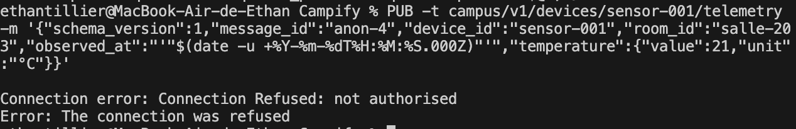

# Preuve — usurpation d'un device

Contexte : scénario "Usurpation d'un device" (`J3.md`). Vérifie que rien
n'empêchait, avant [ADR 0008](../decisions/0008-identite-devices-authentification-mqtt.md),
un client quelconque de publier sur le topic de télémétrie d'un autre
device — et que la mitigation posée (auth + ACL par device sur le
mosquitto local) bloque effectivement ce cas, sans casser le
fonctionnement normal.

Environnement : mosquitto local (`backend/docker-compose.yml`), identités
`sensor-001`/`sensor-002`/`sensor-003` générées via `mosquitto_passwd`
(voir `backend/README.md`), backend connecté dessus.

## Hypothèse

Sans authentification, n'importe qui peut publier sur le topic d'un autre
device. Avec `allow_anonymous false` + ACL par device
(`pattern write campus/v1/devices/%u/telemetry`), trois cas doivent se
distinguer :

1. Une connexion anonyme est refusée dès le `CONNECT`.
2. `sensor-001` qui tente de publier sur le topic de `sensor-002` est
   bloqué par l'ACL (le message ne doit jamais atteindre le backend).
3. `sensor-001` qui publie sur son propre topic est accepté normalement
   (la mitigation ne doit pas bloquer le cas légitime).

## Manipulation

```bash
cd backend
PUB() { docker run --rm --network backend_default eclipse-mosquitto:2 mosquitto_pub -h mosquitto -p 1883 "$@"; }

# 1) anonyme
PUB -t campus/v1/devices/sensor-001/telemetry -m '{"schema_version":1,"message_id":"anon-4","device_id":"sensor-001","room_id":"salle-203","observed_at":"'"$(date -u +%Y-%m-%dT%H:%M:%S.000Z)"'","temperature":{"value":21,"unit":"°C"}}'

# 2) usurpation : sensor-001 publie sur le topic de sensor-002
PUB -u sensor-001 -P changeme-local-only -t campus/v1/devices/sensor-002/telemetry -m '{"schema_version":1,"message_id":"usurp-4","device_id":"sensor-002","room_id":"salle-204","observed_at":"'"$(date -u +%Y-%m-%dT%H:%M:%S.000Z)"'","temperature":{"value":99,"unit":"°C"}}'

# 3) légitime : sensor-001 sur son propre topic
PUB -u sensor-001 -P changeme-local-only -t campus/v1/devices/sensor-001/telemetry -m '{"schema_version":1,"message_id":"legit-4","device_id":"sensor-001","room_id":"salle-203","observed_at":"'"$(date -u +%Y-%m-%dT%H:%M:%S.000Z)"'","temperature":{"value":21,"unit":"°C"}}'
```

## Observation

### 1) Connexion anonyme — refusée immédiatement

```
Connection error: Connection Refused: not authorised
Error: The connection was refused
```



### 2) Usurpation — droppée silencieusement par l'ACL

Aucune sortie côté client (`mosquitto_pub` ne reçoit pas d'accusé de
rejet sur un `PUBLISH` refusé par l'ACL — contrairement au `CONNECT`
anonyme ci-dessus, c'est un comportement MQTT normal, pas une preuve
d'échec du test). La preuve se lit côté backend, par l'absence :

```bash
docker compose logs backend --tail 50 | grep -c usurp-4
# → 0
```

### 3) Contrôle légitime — accepté et ingéré normalement

```bash
docker compose logs backend --tail 50 | grep legit-4
# → {"status":"ingested","deviceId":"sensor-001","type":"temperature","value":21,...}
```

## Explication

La confiance dans un `deviceId` se construit **au niveau de la connexion
MQTT** (qui a le droit de publier où), jamais après coup côté backend :
`driving/mqtt/handlers.ts` résout le `deviceId` depuis le topic, pas
depuis le payload (voir [ADR 0004](../decisions/0004-contrat-mqtt-placeholder.md))
— un choix qui suppose que seul le vrai device puisse publier sur son
propre topic. C'est exactement ce que l'ACL du broker local garantit
depuis [ADR 0008](../decisions/0008-identite-devices-authentification-mqtt.md) :
aucune validation applicative (Zod, plausibilité) n'aurait pu compenser
une usurpation, puisqu'un message usurpé peut être structurellement et
physiquement parfaitement valide.

Le fait que `usurp-4` soit totalement absent des logs backend (pas
rejeté, pas tracé — absent) montre que le blocage a lieu **avant**
d'atteindre le domaine, pas après coup par une règle métier. Le contrôle
légitime (`legit-4`, ingéré normalement avec les mêmes identifiants MQTT)
élimine l'hypothèse alternative "le test n'a rien envoyé du tout".

## Décision

Mitigation en place et suffisante sur l'infrastructure qu'on contrôle
(broker local). **Limite assumée, non traitée** : le broker de
démonstration du kit (VPS partagé) reste hors de notre contrôle — on
ignore s'il authentifie individuellement ses devices simulés. Voir
« Limites connues » dans `docs/J3.md`.

## Vérification

À rejouer identiquement en cas de modification de `mosquitto.acl` ou de
`mosquitto.conf` — mêmes trois commandes, mêmes résultats attendus
(anonyme refusé, usurpation absente des logs, légitime ingéré).
